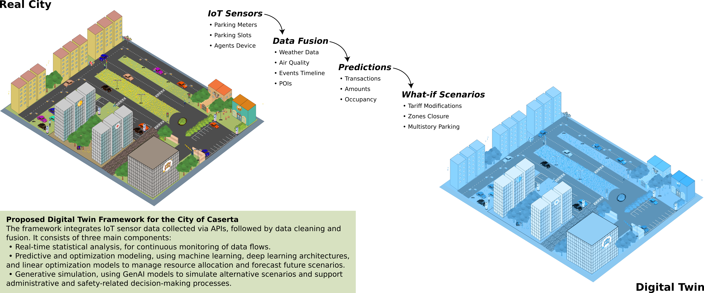

# PREDICO - Predictive Replica for Enhanced Digital Intelligence in City Optimization

## Abstract
Rapid urbanization and population growth have created significant challenges in urban mobility management, such as traffic congestion, inefficient public transportation, and environmental pollution. This paper presents PREDICO (Predictive Replica for Enhanced Digital Intelligence in City Optimization), development and implementation of a Digital Twin (DT) aimed at addressing issues within the context of smart mobility. PREDICO integrates a wide range of historical and real-time data, including parking meter transactions, revenue records, street occupancy rates, parking violations, and sensor-based parking slot utilization. Additionally, the data encompass weather conditions, temporal patterns (such as weekdays and peak hours), and agent shift schedules, offering a comprehensive dataset for analyzing and optimizing urban mobility dynamics. Descriptive statistics are used to identify key patterns, while advanced Machine Learning (ML) and Deep Learning (DL) algorithms enhance predictive and generative analytics, forecasting parking demand and simulating various mobility scenarios. These insights, combined with visualization tools, map data onto the urban landscape, enabling spatial planning and resource allocation. Moreover, the integration of Generative Artificial Intelligence (GenAI) models significantly improves the system's capabilities, generating realistic "what-if" scenarios that allow for virtual testing of mobility strategies before real-world implementation.
The results highlight the PREDICO potential to improve urban mobility management, especially improving parking meter placement and enhancing the quality of urban mobility for users by reducing inefficiencies and improving accessibility. Tested on real-world data from the city of Caserta, the proposed framework has proven robust and adaptable, although expanding the dataset and refining specific components are necessary for fully realizing its potential and ensuring sustainable urban planning.





## Acknowledgments
The authors would like to thank K-city srl company (https://www.k-city.eu/) for their support, collaboration, and provision of the data. In particular, special thanks go to Dr. Giuseppe Morelli and Dr. Sebastiano Spina. The authors also thank the city of Caserta, including its mayor and staff, for their support.


## Data Availability
The data used in this study are not publicly available due to confidentiality agreements and data protection policies. However, this GitHub repository provides detailed information on the data structure, format, and preprocessing procedures. For all datasets used in this study, example files containing a single sample are provided to allow users to generate their own data based on these templates. Specifically, for the agent shift schedule, we provide the compiled version, which takes as input an altered version of the original data. Researchers interested in accessing the full dataset may contact the corresponding author to discuss potential access arrangements under appropriate confidentiality agreements. The weather and air quality data, which are open source, can be downloaded from https://open-meteo.com, while the Points of Interest data, obtained through OpenStreetMap, are available at https://www.openstreetmap.org.


## Requirements

### 1. Forecasting and Generation  
To set up the environment for forecasting and data generation, create a python environment using the provided `environment.yaml` file:  
```sh
conda env create -f environment.yaml
conda activate <your_environment_name>
```

### 2. Scheduling Execution

### Requirements  
Ensure that the following tools are installed:  
- **7-Zip**: Required to extract project files.  
  - On Windows: Download from [https://www.7-zip.org/](https://www.7-zip.org/)  
  - On Linux: Install using `sudo apt install p7zip-full` (Debian/Ubuntu) or `sudo pacman -S p7zip` (Arch)  
- **HiGHS version 1.7**: Must be installed in the `scheduling` directory.  
  - If not already available, download it from [HiGHS GitHub](https://github.com/ERGO-Code/HiGHS)  

### Execution Instructions  
1. Extract the main archive using 7-Zip:  
   ```sh
   7z x main_zip/main.7z.001 -o"./"
   ```
2. Run the main script using the shell script:
   ```sh
    bash run.sh -e "2025-01-12" -o outputs -i inputs
 
